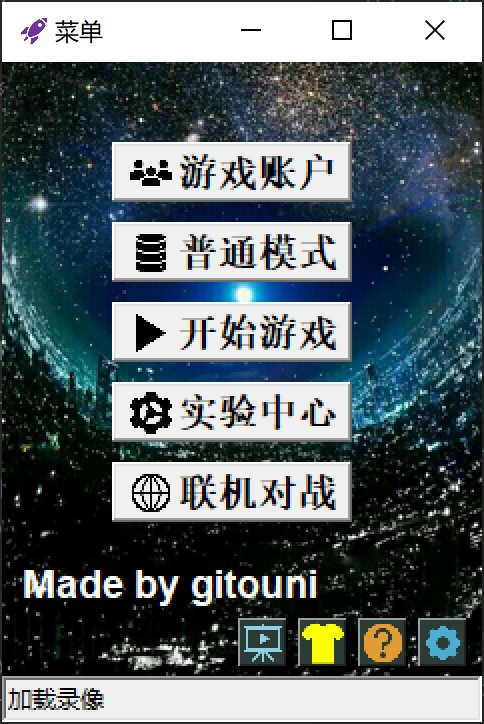
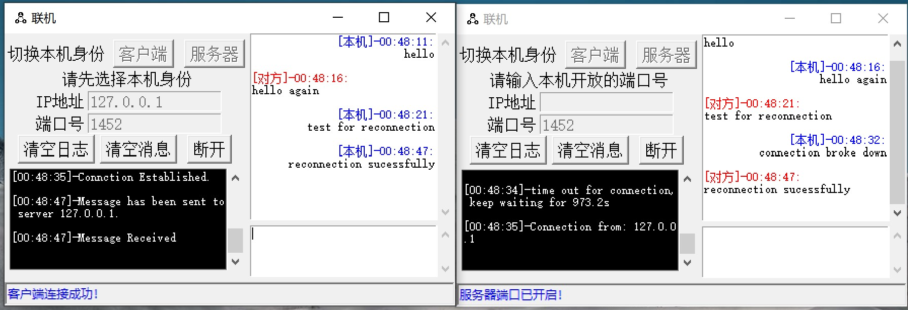

# pygame飞机大战:airplane:终极版
[中文版](https://github.com/gitouni/pygame-aircraft-wars-Ultra/blob/c77bc77efeee6f9910b62cec382c28be3b2be28d/README.md) | [English](https://github.com/gitouni/pygame-aircraft-wars-Ultra/blob/c77bc77efeee6f9910b62cec382c28be3b2be28d/README_EN.md)
### 介绍
Pygame飞机大战终极版是一款基于Pygame引擎开发的，涵盖GUI界面、账户系统、奖励系统、自定义场景、武器升级系统、联机对战的炫酷飞机大战游戏。

一些游戏元素:video_game:展示如下：
主界面

游戏界面

联机聊天界面

* 射击音效，击中音效，爆炸音效，奖励音效
* 玩家状态：血条、能量和冷却
* 玩家奖励：黄金:moneybag:、钻石
* 玩家武器：子弹:gun:、导弹:rocket:
* 实验室：可使用黄金、钻石升级，黄金用于基础升级，钻石是高等级提升时所需的升级材料
* 后续增设：

可自定义的地图/场景设计器 （根据scene.py进行书写）

无限模式（会根据玩家的胜率自适应调整难度）

符文系统（击落敌机会概率掉落功能性符文，可随武器系统一起升级）

Boss机制（正在制作中，敬请期待）

### 如何开始
* Install:

`pip install -r requirements.txt`

Python>=3.7.1 recommended
* Run:

`python main.py`

### 游戏玩法（中文版可点击右下角的帮助按钮查看）:
* 操作:

开火/停火: F

射击: Q/W/E

发射导弹:rocket:: Space

移动: up/down/left/right

* 攻略:

首先创建你的账户（初始资源为2万金币，200钻石，快去实验室选择自己心仪的升级吧，注意保存之后不能撤销哦）

状态栏：血条、能量、冷却

开火和发射导弹均消耗能量和冷却，请合理搭配。

玩得开心！
